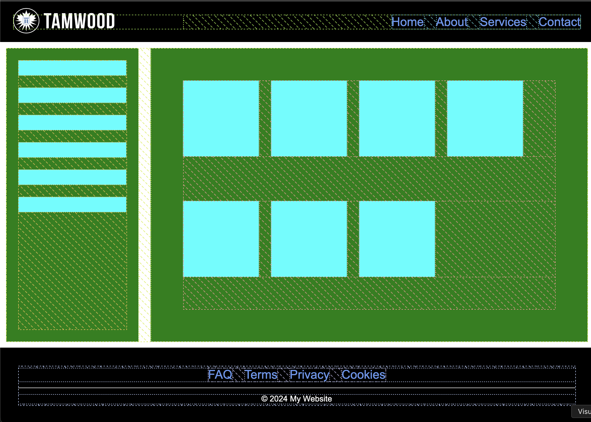

# Flexbox Layouts

The objetive of this project is pratice and expand knowledge of HTML and CSS by creating some pages with layouts
that employ flexbox elements.

Check the requirements [here](/flexbox-layouts/docs/Assignment%20-%20CSS%20Flexbox%20Layouts.pdf)

## Checlists 

1. GitHub Repository - https://github.com/viniciusmarson/tamwood/tree/assignment-day-11

The itens above just change the header and the footer, so after made the changes in the global css, all the 3 pages was affected.

2. Footer with Flexbox - Inside [index](./index.html)
3. Floated Left + Flexbox - Inside [index](./index.html)
4. Floated Right + Flexbox - Inside [about](./about.html)

5. Flexbox Layout - Inside [services](./services.html)

6. Flexbox Gallery - Inside [contact](./contact.html)

